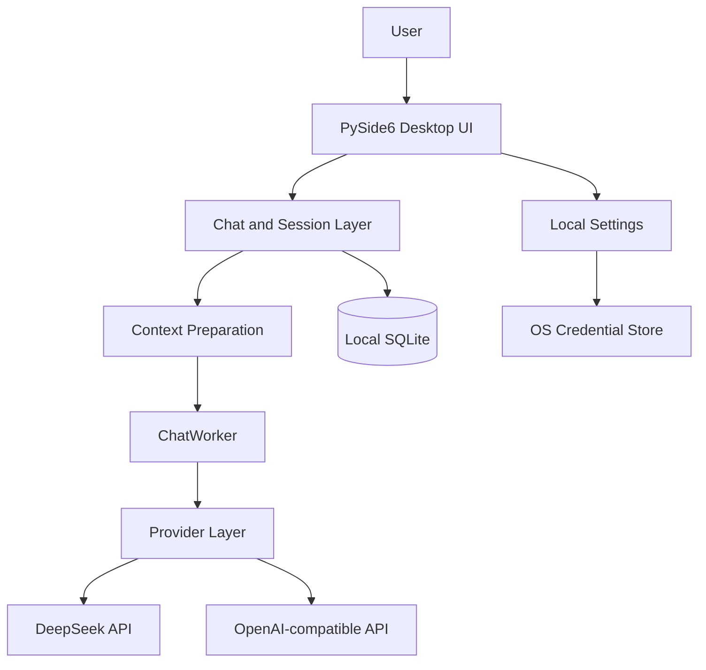

# DSCode Assistant

> A local-first open-source AI coding assistant for developers, students, and small teams.

[简体中文](README.zh-CN.md) · [Documentation](docs/README.md) · [Contributing](CONTRIBUTING.md) · [Code of Conduct](CODE_OF_CONDUCT.md) · [Changelog](CHANGELOG.md) · [License](LICENSE)

DSCode Assistant is a local-first open-source AI coding assistant built with Python and PySide6. The desktop client connects directly from the user's computer to a configured model provider and does not require a DSCode account, a developer-operated relay server, or telemetry collection.

Current public version: **v0.6.0**

## Project Introduction

DSCode Assistant provides a focused desktop workflow for programming conversations while keeping application data under the user's control. API credentials are stored through the operating system credential store, ordinary settings are local JSON, and chat history is stored in a local SQLite database.

Only the conversation context that the user sends is transmitted to the selected model provider. Users remain responsible for reviewing the provider's privacy policy, retention rules, and pricing.

## Features

- Streaming AI chat with stop-generation support and user-facing error messages
- Markdown rendering, syntax-highlighted code blocks, and copy actions
- Local SQLite conversation history with search, rename, and delete operations
- API keys stored with the operating system credential store through `keyring`
- Multi-provider architecture with DeepSeek and OpenAI-compatible providers
- Provider, model, Temperature, Max Tokens, and timeout configuration
- Raw and deterministic Light context-optimization modes
- Local token estimates and context-protection statistics for the current request
- Built-in programming prompt templates
- A localhost-only Automation interface for activating the application and creating task drafts
- Windows portable and installer build workflows

## Architecture Overview



The application has no DSCode-operated cloud backend. `ChatWorker` performs provider requests outside the GUI thread, while session data and settings remain local.

## Supported Providers

### DeepSeek

The built-in `DeepSeekProvider` wraps the existing DeepSeek API client and supports streaming responses. In this mode, requests are sent directly to the official DeepSeek API endpoint.

### OpenAI-compatible provider

The `OpenAICompatibleProvider` supports configurable HTTP or HTTPS base URLs that expose compatible `/models` and `/chat/completions` endpoints. This can be used with a compatible hosted service or a locally operated endpoint.

DSCode Assistant does not claim compatibility with every implementation. Provider-specific parameters and response extensions may differ.

## Context Optimization

Context Optimization is the main public addition in v0.6.0. It prepares the existing conversation locally before it is passed to `ChatWorker` and the selected provider.

Available modes:

- **Raw**: copies the current request messages without changing their order or content.
- **Light**: applies deterministic cleanup. It removes empty or invalid placeholder messages, removes exact consecutive duplicates where safe, and merges short consecutive messages from the same role within fixed limits.
- **Auto (experimental placeholder)**: the setting is preserved for compatibility, but v0.6.0 currently processes it as Raw.

Light mode protects critical messages from deletion, deduplication, merging, or rewriting. Protected content includes system instructions, the current task, the latest valid assistant response, code fences, patches, error logs, explicit constraints, and file references. Language detection can add local hints for supported programming-language error patterns.

Important boundaries:

- Context preparation is local and deterministic.
- It does not call another model or create an additional API request.
- It does not summarize or semantically rewrite source code.
- Token counts shown in the UI are local estimates, not provider billing records.
- Reduction depends on the actual conversation; no fixed savings percentage is promised.

## Privacy Design

- No mandatory account system
- No DSCode-operated relay or data-collection server
- No telemetry or usage analytics
- API keys are not written to `settings.json` or SQLite
- Chat history and ordinary settings remain on the user's computer
- Privacy-safe diagnostics do not record chat content, API keys, request bodies, or raw exception text
- DeepSeek mode accesses the official DeepSeek API; OpenAI-compatible mode accesses the base URL configured by the user
- The local Automation interface listens only on `127.0.0.1`

On Windows, application data is stored under `%APPDATA%\DSCodeAssistant`.

## Screenshots

Sanitized project screenshots are planned for the following locations:

- `docs/images/main-window.png`
- `docs/images/settings.png`

The repository does not currently ship screenshots because no reviewed, privacy-safe screenshots are available. See [docs/images/README.md](docs/images/README.md) before contributing images.

## Installation Guide

### Windows installer

1. Download `DSCode Assistant Setup v0.6.0.exe` from the GitHub Release.
2. Run the installer and choose an installation directory.
3. Optionally create a desktop shortcut.
4. Start DSCode Assistant and configure a provider.

### Windows portable package

1. Download `DSCode Assistant v0.6.0 Portable.zip`.
2. Extract the complete archive.
3. Run `DSCode Assistant.exe`.

Keep the packaged `_internal` directory next to the executable.

### Run from source

Python 3.11 or later is required.

```powershell
git clone https://github.com/suisui0601a-pixel/DSCode-Assistant.git
cd DSCode-Assistant
python -m venv .venv
.venv\Scripts\activate
python -m pip install --upgrade pip
python -m pip install -r requirements.txt
python -m dscode_assistant
```

On macOS or Linux, use the platform-appropriate virtual-environment activation command. Prebuilt releases currently focus on Windows; source execution still requires a working Qt/PySide6 desktop environment.

## Configuration Guide

1. Open **Settings**.
2. Select **DeepSeek** or **OpenAI Compatible**.
3. Configure the API key and model. OpenAI-compatible users must also configure the Base URL.
4. Choose Temperature, Max Tokens, timeout, and Context Optimization mode.
5. Test the connection and save the settings.
6. Create a conversation and send a programming question.

For OpenAI-compatible local endpoints, the API key may be left empty when the endpoint does not require authentication. Never place real credentials in source files, Issues, screenshots, or logs.

Additional guides:

- [API configuration](docs/API_Configuration.md)
- [User guide](docs/User_Guide.md)
- [Windows guide](docs/Windows_User_Guide.md)
- [FAQ](docs/FAQ.md)

## Local Automation Interface

While the application is running, a small JSON interface is available at `127.0.0.1:18765` for local activation, project selection, status queries, and task-draft creation.

This interface does not execute an autonomous agent and does not call a model automatically.

| Method | Path | Purpose |
| --- | --- | --- |
| `GET` | `/v1/status` | Read local application status |
| `POST` | `/v1/app/activate` | Activate the desktop window |
| `POST` | `/v1/projects/open` | Set the current project path |
| `POST` | `/v1/tasks` | Create a user-reviewable task draft |

## Development Guide

The project intentionally keeps a direct desktop architecture without an account service, web frontend, ORM, or telemetry stack.

Main modules:

```text
dscode_assistant/
├── app.py                 # application bootstrap and dependency assembly
├── main_window.py         # main window and session navigation
├── chat_widget.py         # chat workflow and ChatWorker integration
├── model_providers.py     # provider contract and adapters
├── context/               # deterministic context preparation and protection
├── languages/             # local language metadata and detection
├── database.py            # SQLite persistence
├── settings.py            # local settings and keyring access
└── automation.py          # localhost-only automation interface
```

Install development dependencies, then run:

```powershell
python -m compileall -q dscode_assistant tests
python -m pytest -q
```

Windows packaging:

```bat
build_windows.bat
```

Generated packages are written under `release/` and are excluded from Git.

See [the development guide](docs/Development_Guide.md) and [CONTRIBUTING.md](CONTRIBUTING.md) before submitting changes.

## Release Notes

- [v0.6.0 release changelog](CHANGELOG_v0.6.0.md)
- [Full changelog](CHANGELOG.md)
- [v0.1.0 historical release notes](RELEASE_NOTES_v0.1.0.md)

## Support

Use [GitHub Issues](https://github.com/suisui0601a-pixel/DSCode-Assistant/issues) for reproducible bugs and feature requests. Remove API keys, private source code, local databases, private paths, and personal information before posting.

- International support: [dscode.assistant@gmail.com](mailto:dscode.assistant@gmail.com)
- 国内用户支持: [qwertyuiop076@163.com](mailto:qwertyuiop076@163.com)

## License

DSCode Assistant is licensed under the [MIT License](LICENSE). MIT permits commercial use; the project being maintained as a free, non-profit-oriented open-source effort does not add a non-commercial restriction to the license.

## Disclaimer

DSCode Assistant is not affiliated with or endorsed by DeepSeek. Provider availability, model output, content compliance, retention, and API charges are governed by the selected provider and the user's account.
