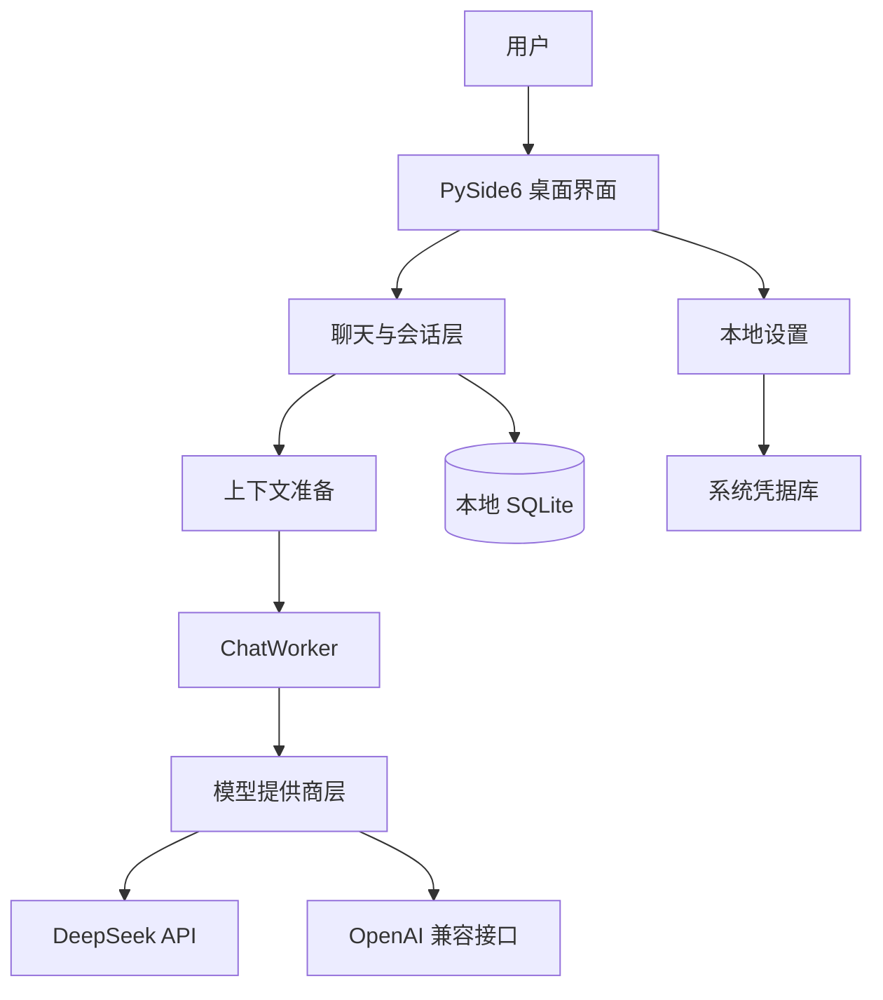

# DSCode Assistant

> 面向开发者、学生和小团队的本地优先开源 AI 编程助手。

[English](README.md) · [文档](docs/README.zh-CN.md) · [贡献指南](CONTRIBUTING.zh-CN.md) · [行为准则](CODE_OF_CONDUCT.zh-CN.md) · [变更记录](CHANGELOG.zh-CN.md) · [开源协议](LICENSE)

DSCode Assistant 是一款使用 Python 与 PySide6 开发的本地优先开源 AI 编程助手。桌面客户端由用户电脑直接连接所配置的模型提供商，不要求 DSCode 账号，不使用开发者中转服务器，也不收集遥测数据。

当前公开版本：**v0.6.0**

## 项目介绍

DSCode Assistant 为编程对话提供专注的桌面工作流，同时让用户保有应用数据控制权。API 密钥通过操作系统凭据库存储，普通设置保存为本地 JSON，聊天历史保存在本地 SQLite 数据库。

只有用户主动发送的当前会话上下文会提交给所选模型服务。用户仍需自行确认模型服务商的隐私政策、数据保留规则和计费方式。

## 功能

- 流式 AI 聊天、停止生成和错误提示
- Markdown 渲染、代码高亮、代码与消息复制
- SQLite 本地会话历史、搜索、重命名与删除
- 通过 `keyring` 使用操作系统凭据库存储 API 密钥
- 支持 DeepSeek 与 OpenAI 兼容接口的多模型提供商架构
- 模型提供商、模型、Temperature、Max Tokens 和超时设置
- Raw 与确定性 Light 上下文优化模式
- 当前请求的本地 Token 估算和上下文保护统计
- 内置编程 Prompt 模板
- 仅限 localhost 的本地 Automation 接口
- Windows 便携版与安装包构建流程

## 架构概览



应用不存在 DSCode 运营的云端后端。`ChatWorker` 在 GUI 线程之外执行模型请求，会话和设置数据保存在本机。

## 支持的模型提供商

### DeepSeek

内置 `DeepSeekProvider` 对现有 DeepSeek API Client 进行适配，支持流式响应。该模式下请求由用户电脑直接发送至 DeepSeek 官方 API。

### OpenAI 兼容接口

`OpenAICompatibleProvider` 支持配置提供兼容 `/models` 和 `/chat/completions` 接口的 HTTP 或 HTTPS Base URL，可用于兼容的云服务或本地服务。

DSCode Assistant 不承诺兼容所有实现；不同服务的参数和响应扩展可能存在差异。

## 上下文优化

上下文优化是 v0.6.0 的主要公开新增能力。它会在消息交给 `ChatWorker` 和所选模型提供商前，在本机准备当前会话上下文。

可用模式：

- **Raw**：复制当前请求消息，不改变顺序和内容。
- **Light**：执行确定性清理，包括删除空消息和无效占位消息、在安全条件下删除完全重复的连续消息，以及在固定限制内合并同角色的连续短消息。
- **Auto（实验占位）**：保存配置以保持兼容，但 v0.6.0 当前按 Raw 处理。

Light 模式不会删除、去重、合并或改写关键消息。受保护内容包括 system 指令、当前任务、最近有效 AI 回复、代码围栏、补丁、错误日志、明确约束和文件引用。语言检测可为已支持编程语言的错误特征提供本地提示。

能力边界：

- 上下文准备完全在本机执行，规则确定且可复现。
- 不会额外调用模型或产生额外 API 请求。
- 不会摘要或语义改写用户代码。
- UI 中的 Token 数为本地估算，不是服务商账单数据。
- 实际减少量取决于会话内容，不承诺固定节省比例。

## 隐私设计

- 无强制账号系统
- 无 DSCode 中转服务器或数据收集服务器
- 无遥测或使用统计
- API 密钥不写入 `settings.json` 或 SQLite
- 聊天历史和普通设置保存在用户电脑
- 隐私安全日志不记录聊天正文、API 密钥、请求体或异常原文
- DeepSeek 模式访问官方 API；OpenAI 兼容接口模式访问用户配置的 Base URL
- 本地 Automation 接口仅监听 `127.0.0.1`

Windows 用户数据目录为 `%APPDATA%\DSCodeAssistant`。

## 软件截图

经过脱敏审查的软件截图计划放置于：

- `docs/images/main-window.png`
- `docs/images/settings.png`

仓库当前不附带截图，因为尚无经过确认的隐私安全截图。贡献截图前请阅读 [docs/images/README.md](docs/images/README.md)。

## 安装方式

### Windows 安装版

1. 从 GitHub Release 下载 `DSCode Assistant Setup v0.6.0.exe`。
2. 运行安装程序并选择安装目录。
3. 按需创建桌面快捷方式。
4. 启动 DSCode Assistant 并配置模型提供商。

### Windows 便携版

1. 下载 `DSCode Assistant v0.6.0 Portable.zip`。
2. 解压完整目录。
3. 运行 `DSCode Assistant.exe`。

请保留 EXE 旁边的 `_internal` 目录。

### 从源码运行

需要 Python 3.11 或更高版本：

```powershell
git clone https://github.com/suisui0601a-pixel/DSCode-Assistant.git
cd DSCode-Assistant
python -m venv .venv
.venv\Scripts\activate
python -m pip install --upgrade pip
python -m pip install -r requirements.txt
python -m dscode_assistant
```

macOS 和 Linux 请使用对应平台的虚拟环境激活命令。当前预构建发布包以 Windows 为主，源码运行仍需具备 Qt/PySide6 图形环境。

## 配置说明

1. 打开“设置”。
2. 选择 DeepSeek 或 OpenAI 兼容接口。
3. 配置 API 密钥和模型；OpenAI 兼容接口还需配置 Base URL。
4. 选择 Temperature、Max Tokens、超时和上下文优化模式。
5. 测试连接并保存设置。
6. 新建会话并发送编程问题。

OpenAI 兼容本地服务不要求鉴权时，API 密钥可以留空。不要把真实凭据写入源码、Issue、截图或日志。

更多文档：

- [API配置说明](docs/API配置说明.md)
- [用户使用说明](docs/用户使用说明.md)
- [Windows 使用说明](docs/Windows_User_Guide.zh-CN.md)
- [常见问题](docs/常见问题.md)

## 本地 Automation 接口

应用运行时在 `127.0.0.1:18765` 提供小型 JSON 接口，用于本地激活、项目选择、状态查询和任务草稿创建。

该接口不会执行自主 Agent，也不会自动调用模型。

| 方法 | 路径 | 作用 |
| --- | --- | --- |
| `GET` | `/v1/status` | 查询本地应用状态 |
| `POST` | `/v1/app/activate` | 激活桌面窗口 |
| `POST` | `/v1/projects/open` | 设置当前项目路径 |
| `POST` | `/v1/tasks` | 创建待用户确认的任务草稿 |

## 开发说明

项目保持直接的桌面架构，不引入账号服务、网页前端、ORM 或遥测系统。

主要模块：

```text
dscode_assistant/
├── app.py                 # 应用启动与依赖装配
├── main_window.py         # 主窗口和会话导航
├── chat_widget.py         # 聊天流程与 ChatWorker 接入
├── model_providers.py     # 模型提供商契约和适配器
├── context/               # 确定性上下文准备与保护
├── languages/             # 本地语言元数据与检测
├── database.py            # SQLite 持久化
├── settings.py            # 本地设置和 keyring
└── automation.py          # localhost Automation 接口
```

开发检查：

```powershell
python -m compileall -q dscode_assistant tests
python -m pytest -q
```

Windows 打包：

```bat
build_windows.bat
```

构建产物输出到 `release/`，不会提交到 Git。

提交修改前请阅读[开发说明](docs/开发说明.md)和[贡献指南](CONTRIBUTING.zh-CN.md)。

## 版本说明

- [v0.6.0 版本变更](CHANGELOG_v0.6.0.zh-CN.md)
- [完整变更记录](CHANGELOG.zh-CN.md)
- [v0.1.0 历史版本说明](RELEASE_NOTES_v0.1.0.md)

## 联系方式

可复现 Bug 和功能建议请优先提交到 [GitHub Issues](https://github.com/suisui0601a-pixel/DSCode-Assistant/issues)。提交前请移除 API 密钥、私人代码、本地数据库、私人路径和个人信息。

- International support: [dscode.assistant@gmail.com](mailto:dscode.assistant@gmail.com)
- 国内用户支持：[qwertyuiop076@163.com](mailto:qwertyuiop076@163.com)

## 开源协议

项目使用 [MIT License](LICENSE)。MIT 允许商业使用；项目以免费、无盈利目的的开源方式维护，不会为协议额外增加“禁止商业使用”限制。

## 免责声明

DSCode Assistant 与 DeepSeek 官方不存在隶属或担保关系。模型服务可用性、模型输出、内容合规、数据保留和 API 费用由所选服务商及用户账户规则决定。
